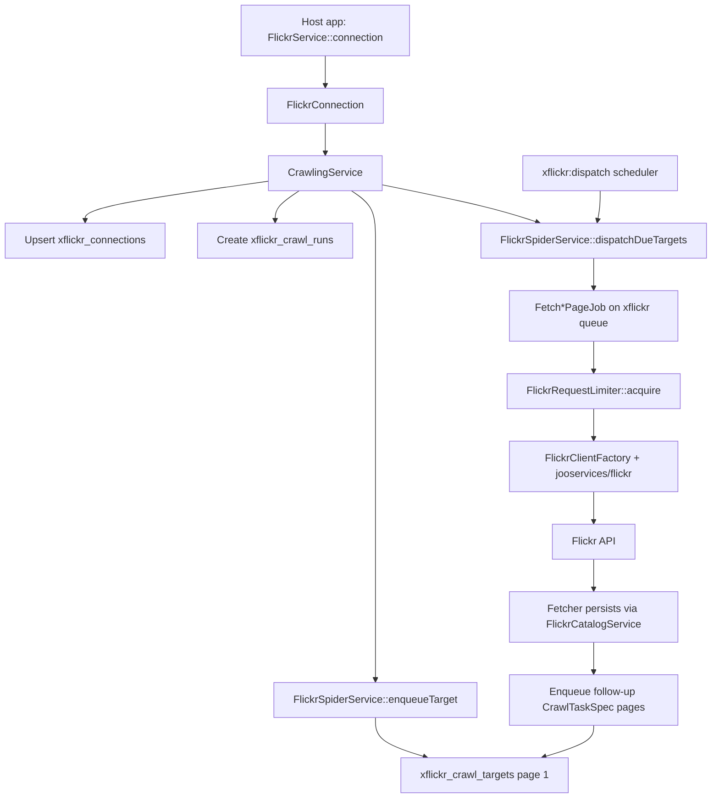

# Data flow

This document expands the crawl pipeline described in [overview.md](./overview.md). It traces a crawl from the host application through queued jobs, Flickr API calls, and MySQL persistence.

## High-level pipeline



## Phase 1 — Crawl start (synchronous)

The host application calls one of the public entry methods:

```php
FlickrService::connection($connectionKey, $tokenJson, appProfile: 'main')->contacts();
// or ->photos($nsid), ->photosets($nsid), ->galleries($nsid)
```

`FlickrCrawlerManager::connection()` returns a `FlickrConnection` bound to the connection key, token payload, and optional app profile.

`CrawlingService` then:

1. **Ensures the connection row** — upserts `xflickr_connections` with `connection_key`, `app_profile`, and `token_payload`.
2. **Guards global pause** — aborts if `xflickr.global_pause` is active in laravel-config.
3. **Creates a crawl run** — inserts `xflickr_crawl_runs` with the appropriate `CrawlType` and optional subject `nsid`.
4. **Enqueues the first target** — creates a page-1 `xflickr_crawl_targets` row via `FlickrSpiderService::enqueueTarget()`.
5. **Dispatches due targets** — immediately pushes eligible targets to the queue (in addition to the scheduler).

The method returns the `CrawlRun` model. No Flickr HTTP calls happen in this synchronous phase beyond what the host app already did for OAuth.

## Phase 2 — Target dispatch

Targets move from database rows to queue jobs through two paths:

- **Immediate dispatch** — `CrawlingService` calls `FlickrSpiderService::dispatchDueTargets()` after enqueueing page 1.
- **Scheduled dispatch** — `xflickr:dispatch` runs every minute (host app scheduler) and calls the same dispatch logic.

`FlickrSpiderService::dispatchDueTargets()`:

1. Skips work when global pause is active.
2. Recovers stalled targets stuck in `Processing` (via `CrawlStall` cutoff).
3. Selects due targets (`Pending` or `Queued`, `next_run_at` reached, lock expired).
4. Orders by priority, then id, up to `xflickr.dispatch_limit`.
5. Maps each `TaskType` to its `Fetch*PageJob` and pushes to the `xflickr` queue.

Target status transitions: `Pending` → `Queued` → `Processing` → `Completed` | `Failed` | `Pending` (retry).

## Phase 3 — Job execution (one API page per job)

Each `Fetch*PageJob` stores only `crawlTargetId`. At runtime:

1. **Load target** — `AbstractXFlickrCrawlJob::loadTarget()` marks the target `Processing` and sets a lock.
2. **Resolve credentials** — load `connection_key` from the crawl run, then `app_profile` and `token_payload` from `xflickr_connections`, then `xflickr_app.{profile}` from laravel-config.
3. **Acquire rate-limit permit** — `FlickrRequestLimiter::acquire($connectionKey)` must succeed before any HTTP call. On denial, the job releases the target for retry with `next_run_at` backoff.
4. **Call Flickr** — `FlickrClientFactory` builds a signed `jooservices/flickr` client; the job invokes the appropriate API method for the task type and page.
5. **Audit** — `FlickrApiAuditService` records request metadata in `xflickr_api_logs`.
6. **Classify outcome** — `FlickrApiOutcomeClassifier` distinguishes success, rate-limit, auth, and transient failures. Rate-limit responses trigger `FlickrRequestLimiter::triggerGlobalCooldown()`.
7. **Persist** — the task's `*Fetcher` parses the response and calls `FlickrCatalogService` for bulk upserts (`upsertMany`, pivot `insertOrIgnore`).
8. **Enqueue follow-ups** — the fetcher returns `FetcherFetchResult` with `CrawlTaskSpec` entries for the next page or child resources. `FlickrSpiderService::enqueueSpecs()` creates new targets; no synchronous page loops.
9. **Complete target** — mark the current target `Completed` and update crawl run progress.

Jobs implement `ShouldBeUnique` per `crawlTargetId` to prevent duplicate processing.

## Phase 4 — Pagination and child tasks

Pagination is always expressed as new targets, never inline HTTP loops in services.

| Crawl type | Initial task | Follow-up tasks |
|------------|--------------|-----------------|
| `contacts` | `ContactsPage` | More `ContactsPage` while `page < pages` |
| `photos` | `PeoplePhotos` | More `PeoplePhotos` while paginated |
| `photosets` | `PhotosetsList` | `PhotosetsPhotos` per photoset, plus list pagination |
| `galleries` | `GalleriesList` | `GalleriesPhotos` per gallery, plus list pagination |

When all targets for a run reach a terminal state, `CrawlRun` status moves to completed.

## Credential flow at job time

Jobs do not receive token or app profile in their constructor. At execution:

```
crawlTargetId
  → crawl_run.connection_key
  → xflickr_connections (app_profile, token_payload)
  → laravel-config xflickr_app.{app_profile} (apiKey, apiSecret)
  → signed Flickr client
```

The user token must have been issued by the same Flickr app as the profile credentials.

## Persistence model

| Data | Primary tables | Write pattern |
|------|----------------|---------------|
| Connections | `xflickr_connections` | Upsert on crawl start |
| Contacts | `xflickr_contacts` | Bulk upsert per page |
| Photos | `xflickr_photos` | Bulk upsert; owners upserted into contacts |
| Photosets | `xflickr_photosets` | Bulk upsert |
| Galleries | `xflickr_galleries` | Bulk upsert |
| Pivots | `xflickr_*_photo` pivots | `insertOrIgnore` in chunks |
| Crawl state | `xflickr_crawl_runs`, `xflickr_crawl_targets` | Per-run lifecycle |
| API audit | `xflickr_api_logs` | One row per HTTP attempt |

## Rate limiting interaction

Every HTTP job calls `FlickrRequestLimiter::acquire($connectionKey)` before the API request. The limiter uses Redis keys scoped per connection:

- `xflickr:req:{key}:window` — sliding hourly window
- `xflickr:req:{key}:last` — minimum gap between requests (Lua)
- `xflickr:pause:{key}` — global cooldown after rate-limit responses

See [Rate limiting](../02-user-guide/02-rate-limiting.md) for operator-facing detail.

## Related documents

- [Overview](./overview.md)
- [Module map](./03-module-map.md)
- [Crawl types](../02-user-guide/01-crawl-types.md)
- [Flickr app profiles](../01-getting-started/app-profiles.md)
