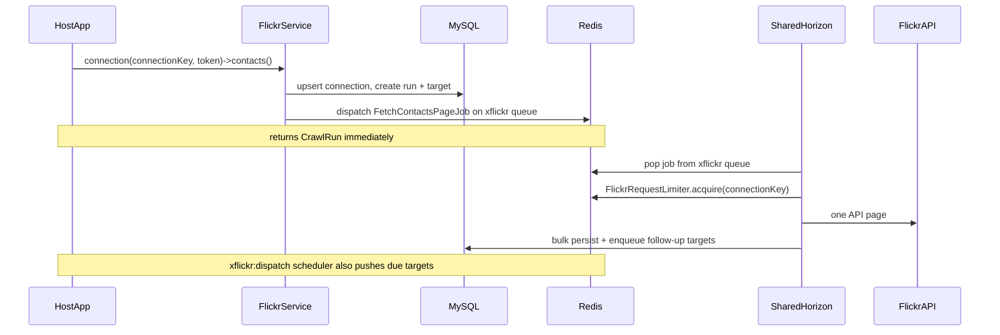

# Host app integration (shared Horizon)

This guide wires **jooservices/xflickr-crawler** into a host Laravel 12 app using the host’s existing Redis queue connection and a single shared Horizon instance.

## Overview



The package does **not** ship its own queue connection, worker, or Horizon config. It uses whatever the host app already runs.

## 1. Install

```bash
composer require jooservices/xflickr-crawler
composer require jooservices/laravel-config
php artisan migrate
```

Optional publish:

```bash
php artisan vendor:publish --tag=xflickr-crawler-config
php artisan vendor:publish --tag=xflickr-crawler-host-integration
```

## 2. Environment

Use the host app’s shared Redis for queues, cache (job uniqueness), and rate limiting:

```env
QUEUE_CONNECTION=redis
REDIS_HOST=127.0.0.1
REDIS_PASSWORD=null
REDIS_PORT=6379

CACHE_STORE=redis

XFLICKR_QUEUE=xflickr
XFLICKR_DEFAULT_APP_PROFILE=main
```

No separate Redis or Horizon process is required.

## 3. Flickr app profile (laravel-config)

Register app credentials in laravel-config — not in `.env`:

```php
use JOOservices\LaravelConfig\Facades\Config;

Config::set('xflickr_app.main', [
    'apiKey' => '...',
    'apiSecret' => '...',
], 'json');
```

See [app-profiles.md](app-profiles.md).

## 4. Choose `connection_key` (rate-limit scope)

**API limits are counted per `connection_key`, not per subject NSID.**

Redis keys:

- `xflickr:req:{connectionKey}:window`
- `xflickr:req:{connectionKey}:last`
- `xflickr:pause:{connectionKey}`

Jobs read `connection_key` from `xflickr_crawl_runs`, **not** `subject_nsid` on the target.

| Identifier | Role | Affects rate limit? |
|------------|------|---------------------|
| `connection_key` | First arg to `FlickrService::connection()` | **Yes** |
| `subject_nsid` | Arg to `photos()` / `photosets()` / `galleries()` | **No** |
| `userNsid` in token JSON | OAuth identity for signing | **No** |

**Host guidance:**

- Use **one stable `connection_key` per OAuth-linked Flickr account** (e.g. host user id).
- Reuse it for contacts, photos, photosets, and galleries — they share one hourly cap.
- Do **not** pass each contact’s NSID as `connection_key` unless you want separate limit buckets.

```php
use JOOservices\XFlickrCrawler\Facades\FlickrService;

$connectionKey = 'user-42';
$token = json_encode([
    'oauthToken' => '...',
    'oauthTokenSecret' => '...',
    'userNsid' => '12037949629@N01',
]);

$conn = FlickrService::connection($connectionKey, $token, appProfile: 'main');

$conn->contacts();
$conn->photos('999@N01');
$conn->photosets('888@N01');
$conn->galleries('777@N01');
```

Inspect limiter state:

```php
FlickrService::limiterState('user-42');
```

## 5. Start crawls from the host app

After OAuth in the host app, call `FlickrService` only — do not dispatch package jobs directly:

```php
$run = FlickrService::connection($connectionKey, $token, appProfile: 'main')->contacts();
```

Each method returns a `CrawlRun` immediately. HTTP work runs on the `xflickr` queue (one job per API page).

## 6. Scheduler

In host `routes/console.php`:

```php
use Illuminate\Support\Facades\Schedule;

Schedule::command('xflickr:dispatch')->everyMinute();
```

Pagination depends on this scheduler. Crawl start also dispatches page 1 immediately.

## 7. Horizon (shared instance)

Add the `xflickr` queue to the host’s `config/horizon.php`. Published stub: `stubs/host-integration/horizon-supervisor.php`.

**Option A — merged supervisor**

```php
'queue' => ['default', 'xflickr'],
```

**Option B — dedicated supervisor (recommended)**

```php
'supervisor-xflickr' => [
    'connection' => 'redis',
    'queue' => ['xflickr'],
    'balance' => 'auto',
    'maxProcesses' => 3,
    'timeout' => 120,
    'tries' => 3,
],
```

One `php artisan horizon` process manages all supervisors.

## Throttling with shared workers

Rate limiting is cooperative Redis limiting keyed by `connection_key`:

1. Worker pops `Fetch*PageJob` from `xflickr` queue
2. Job loads `connection_key` from the crawl run
3. `acquirePermit()` loops until `FlickrRequestLimiter::acquire($connectionKey)` succeeds
4. All jobs for the same `connection_key` share one hourly window — regardless of subject NSID
5. On Flickr rate-limit response → `triggerGlobalCooldown($connectionKey)`

Different `connection_key` values get separate limit budgets.

## Monitoring

- `xflickr_crawl_runs` — run status
- `xflickr_crawl_targets` — per-page tasks, `next_run_at`, retries
- `xflickr_api_logs` — HTTP audit (`connection_key` column)
- `xflickr_*` catalog tables

## Rules

1. Start crawls only via `FlickrService::connection()`.
2. One stable `connection_key` per OAuth account.
3. OAuth stays in the host app.
4. No synchronous page loops in host code.
5. Redis reachable from web, scheduler, and Horizon.

## Smoke test

1. Register `xflickr_app.main` in laravel-config
2. `QUEUE_CONNECTION=redis`, `CACHE_STORE=redis`, Horizon with `xflickr` queue
3. Schedule `xflickr:dispatch` every minute
4. `FlickrService::connection($connectionKey, ...)->contacts()`
5. `->photos($contactNsid)` — confirm `limiterState($connectionKey)` is shared
6. Verify jobs in Horizon, targets complete, `xflickr_api_logs.connection_key` matches

## Related

- [Installation](install.md)
- [Rate limiting](../02-user-guide/02-rate-limiting.md)
- [Architecture data flow](../00-architecture/02-data-flow.md)
